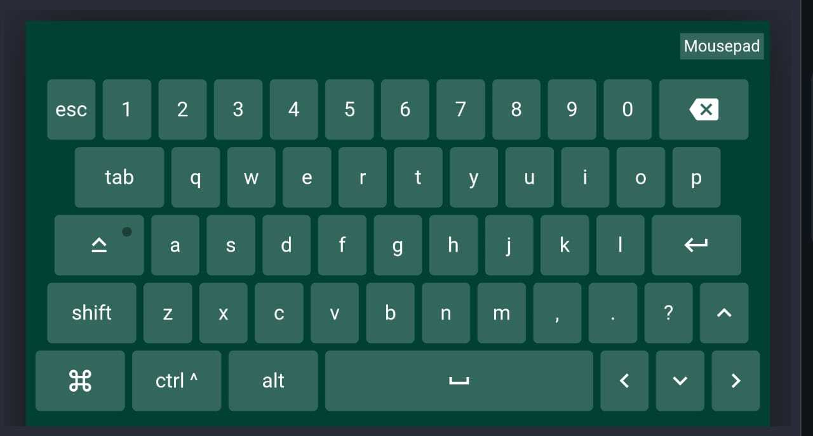

# Remote keyboard and mouse

Watch content on a large monitor but don't want to f*ck your eyes up? This is a simple keyboard/mouse to operate your PC from a mobile phone. Just need both PC and mobile to be on the same local network.

## Screenshots

### Keyboard


### Mousepad


### Installation

 - Clone the project:
```sh
git clone https://github.com/mohit-s96/remote-keyboard.git
```
- Install the dependencies:
```sh
pip install -r requirements.txt
```
- Make `run.sh` executable
```sh
chmod +x run.sh
```

You can now run the server with `./run.sh` and access the keyboard on your phone by going to the url shown on the terminal (something like 192.68.x.xx:5000).

### Known Issues
- Long press doesn't work on keyboard
- Mouse movement is a little janky
- Mouse double click does not work on macos
- Mouse scroll and drag doesn't work
- Need to add run command for windows


